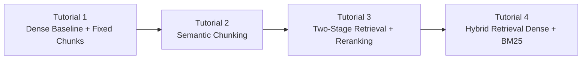

# all-things-rag

Hands-on, four-part RAG tutorial series with a continuous pipeline and measurable comparisons.

## What this repo provides

- A shared Python package in `src/rag_tutorials` for:
	- synthetic data generation
	- chunking (fixed + semantic)
	- embeddings + vector indexing (OpenAI + ChromaDB)
	- keyword retrieval + hybrid fusion
	- reranking
	- answer generation + evaluation metrics
- Four Jupyter tutorials in `tutorials/` with progressive changes from part 1 to part 4.
- A common dataset and evaluation slice so differences are comparable across tutorials.

## Tutorial progression (continuity from 1 to 4)



Each tutorial reuses the same:
- domain scenario (international work policy)
- canonical handbook text source and shared query set
- evaluation dimensions: retrieval quality, groundedness proxy, latency

### Why each tutorial exists (challenge-driven progression)

- **Tutorial 1 (dense baseline):** establishes the working end-to-end RAG baseline and exposes first failure modes.
- **Tutorial 2 (semantic chunking):** addresses chunk-boundary/context fragmentation seen in Tutorial 1.
- **Tutorial 3 (reranking):** addresses misordered retrieval candidates that remain after chunking improvements.
- **Tutorial 4 (hybrid retrieval):** addresses exact-term blind spots (for example form IDs/codes) not reliably handled by dense-only retrieval.
- **Tutorial 5 (benchmark):** quantifies tradeoffs so model/architecture choices are based on measured outcomes, not intuition.

## Prerequisites

- Python 3.11.13
- `uv` installed
- OpenAI API key

Optional local pin (recommended for consistency):

```bash
uv python pin 3.11.13
```

## Quick start (`uv`)

1. Create `.env` from the template:

```bash
cp .env.example .env
```

2. Set `OPENAI_API_KEY` in `.env`.

3. Install and lock dependencies:

```bash
uv sync
uv lock
```

4. Start notebooks:

```bash
uv run jupyter lab
```

5. Run tutorials in order:

- `tutorials/01_basic_rag.ipynb`
- `tutorials/02_semantic_chunking.ipynb`
- `tutorials/03_reranking.ipynb`
- `tutorials/04_hybrid_search.ipynb`
- `tutorials/05_rag_comparison.ipynb`

`tutorials/05_rag_comparison.ipynb` runs all four variants side-by-side and outputs a single benchmark table + plots.

## Novice-friendly retrieval transparency

Notebooks include explicit cells that show:
- learning checkpoint narrative: what worked, what failed, and why to move to next tutorial
- embedding matrix shape and sample vector values
- cosine similarity scoring examples
- top-k retrieval tables with chunk IDs and scores
- reranking before/after rank movements
- dense vs keyword vs hybrid comparisons (`Form A-12` example)
- fixed vs semantic chunk boundary visualization on the same handbook section

## Data and artifacts

- Canonical handbook text source: `data/handbook_manual.txt`
- Generated dataset: `data/documents.jsonl`, `data/queries.jsonl`
- Local vector artifacts: `artifacts/chroma/`

If data files are missing, generate them once with:

```bash
uv run python scripts/generate_data.py
```

### Dataset schema

`data/documents.jsonl` (one JSON object per line)
- `doc_id`: unique document/section identifier
- `title`: section title
- `section`: handbook section name
- `text`: section body text

`data/queries.jsonl` (one JSON object per line)
- `query_id`: unique query identifier
- `question`: user-style question text used in retrieval/generation
- `relevant_chunk_ids`: reserved for chunk-level labels (currently empty by default)
- `target_doc_id`: expected source document id for retrieval hit checks
- `target_section`: expected handbook section for analysis/debug
- `rationale`: why this query maps to the target section

Query generation notes:
- Query wording is intentionally varied per section (not a single repeated phrasing) to make retrieval/evaluation behavior more realistic.

Why this file exists:
- Keeps the same question set across all tutorials for fair comparison.
- Supports consistent evaluation (`recall_at_k`, `mrr`, `groundedness`, `latency_ms`).
- Makes failure analysis easy (which variants miss/recover which questions).
